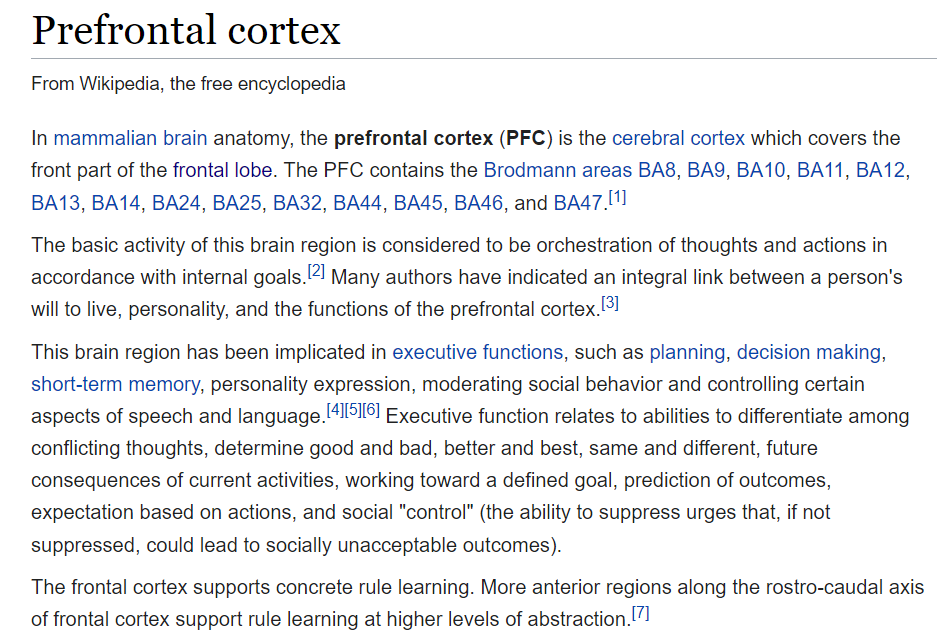

 

    
  </a>

  <h3 align="center">Bionic Reading</h3>

  

    Extension that enables you to read 30% more efficiently and easily!

<!-- ABOUT THE PROJECT -->
## About The Project

This project is based on repo from @itorr

Bionic Reading is a new method facilitating the reading process by guiding the eyes through text with artificial fixation points.
As a result, the reader is only focusing on the highlighted initial letters and lets the brain center complete the word.

Keypoints:
* Does not break hyperlinks
* Refresh page to restore original

### Example images

    

### Usage

Chrome >> Settings >> Extensions >> Enable 'Developer mode' >> Load unpacked >> Select extension folder
